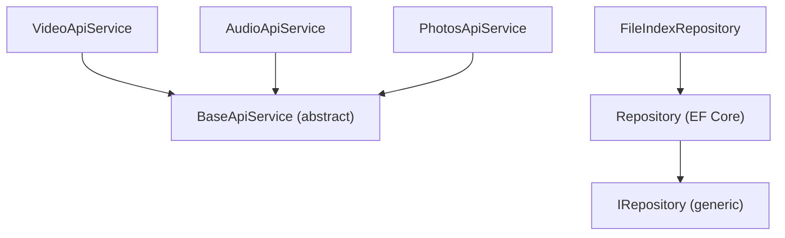

# Create Generic Repository (Flish)

Creates reusable base classes so adding a new entity/media type requires minimal boilerplate on both sides.

## Backend: Generic Repository

### Interface (`back-end/flish/flish/Infrastructure/Persistence/IRepository.cs`)

```csharp
namespace flish.Infrastructure.Persistence;

public interface IRepository<T> where T : class
{
    Task<T?> GetByIdAsync(Guid id, CancellationToken ct);
    Task<List<T>> GetAllAsync(CancellationToken ct);
    Task<(List<T> Items, int Total)> GetPagedAsync(int page, int pageSize, CancellationToken ct);
    Task AddAsync(T entity, CancellationToken ct);
    Task UpdateAsync(T entity, CancellationToken ct);
    Task DeleteAsync(Guid id, CancellationToken ct);
    Task SaveChangesAsync(CancellationToken ct);
}
```

### Implementation (`back-end/flish/flish/Infrastructure/Persistence/Repository.cs`)

```csharp
using Microsoft.EntityFrameworkCore;

namespace flish.Infrastructure.Persistence;

public class Repository<T>(FlishDbContext dbContext) : IRepository<T> where T : class
{
    protected readonly FlishDbContext DbContext = dbContext;
    protected readonly DbSet<T> DbSet = dbContext.Set<T>();

    public async Task<T?> GetByIdAsync(Guid id, CancellationToken ct)
    {
        return await DbSet.FindAsync([id], ct);
    }

    public async Task<List<T>> GetAllAsync(CancellationToken ct)
    {
        return await DbSet.AsNoTracking().ToListAsync(ct);
    }

    public async Task<(List<T> Items, int Total)> GetPagedAsync(int page, int pageSize, CancellationToken ct)
    {
        var total = await DbSet.CountAsync(ct);
        var items = await DbSet
            .AsNoTracking()
            .Skip((page - 1) * pageSize)
            .Take(pageSize)
            .ToListAsync(ct);
        return (items, total);
    }

    public async Task AddAsync(T entity, CancellationToken ct)
    {
        await DbSet.AddAsync(entity, ct);
    }

    public async Task UpdateAsync(T entity, CancellationToken ct)
    {
        DbSet.Update(entity);
        await Task.CompletedTask;
    }

    public async Task DeleteAsync(Guid id, CancellationToken ct)
    {
        var entity = await GetByIdAsync(id, ct);
        if (entity is not null)
        {
            DbSet.Remove(entity);
        }
    }

    public async Task SaveChangesAsync(CancellationToken ct)
    {
        await DbContext.SaveChangesAsync(ct);
    }
}
```

### Extending for a Specific Entity

```csharp
namespace flish.Infrastructure.Persistence;

public class FileIndexRepository(FlishDbContext dbContext)
    : Repository<FileIndexEntry>(dbContext)
{
    public async Task<(List<FileIndexEntry> Items, int Total)> GetPagedFilteredAsync(
        int page, int pageSize, string? query, string? extension, CancellationToken ct)
    {
        var q = DbSet.AsNoTracking().Where(x => !x.IsDeleted);

        if (!string.IsNullOrWhiteSpace(query))
            q = q.Where(x => x.RelativePath.Contains(query));

        if (!string.IsNullOrWhiteSpace(extension))
            q = q.Where(x => x.Extension == extension.TrimStart('.').ToLowerInvariant());

        var total = await q.CountAsync(ct);
        var items = await q
            .OrderBy(x => x.RelativePath)
            .Skip((page - 1) * pageSize)
            .Take(pageSize)
            .ToListAsync(ct);
        return (items, total);
    }
}
```

### Registration in `Program.cs`

```csharp
builder.Services.AddScoped(typeof(IRepository<>), typeof(Repository<>));
builder.Services.AddScoped<FileIndexRepository>();
```

---

## Frontend: Generic API Service

### Base Class (`front-client/src/app/core/services/base-api.service.ts`)

```typescript
import { HttpClient, HttpParams } from '@angular/common/http';
import { inject } from '@angular/core';
import { Observable } from 'rxjs';

export type PagedResponse<T> = {
  items: T[];
  page: number;
  pageSize: number;
  total: number;
};

export abstract class BaseApiService<T extends { id: string }> {
  protected readonly http = inject(HttpClient);
  protected abstract readonly basePath: string;

  list(page: number, pageSize: number, params?: Record<string, string>): Observable<PagedResponse<T>> {
    let httpParams = new HttpParams().set('page', page).set('pageSize', pageSize);
    if (params) {
      for (const [key, value] of Object.entries(params)) {
        if (value !== '') {
          httpParams = httpParams.set(key, value);
        }
      }
    }
    return this.http.get<PagedResponse<T>>(this.basePath, { params: httpParams });
  }

  getById(id: string): Observable<T> {
    return this.http.get<T>(`${this.basePath}/${id}`);
  }

  create(payload: Omit<T, 'id'>): Observable<T> {
    return this.http.post<T>(this.basePath, payload);
  }

  update(id: string, payload: Partial<T>): Observable<T> {
    return this.http.patch<T>(`${this.basePath}/${id}`, payload);
  }

  delete(id: string): Observable<void> {
    return this.http.delete<void>(`${this.basePath}/${id}`);
  }

  streamUrl(id: string): string {
    return `${this.basePath}/${id}/stream`;
  }

  downloadUrl(id: string): string {
    return `${this.basePath}/${id}/download`;
  }
}
```

### Extending for a Specific Feature

```typescript
import { Injectable } from '@angular/core';
import { BaseApiService } from '../../../core/services/base-api.service';
import { MediaItem } from '../models/video.models';

@Injectable({ providedIn: 'root' })
export class VideoApiService extends BaseApiService<MediaItem> {
  protected readonly basePath = '/api/files';

  listVideos(page: number, pageSize: number, query: string) {
    return this.list(page, pageSize, { query, extension: 'mp4,mkv,webm,avi,mov' });
  }
}
```

Another example for audio:

```typescript
import { Injectable } from '@angular/core';
import { BaseApiService } from '../../../core/services/base-api.service';
import { MediaItem } from '../models/audio.models';

@Injectable({ providedIn: 'root' })
export class AudioApiService extends BaseApiService<MediaItem> {
  protected readonly basePath = '/api/files';

  listAudio(page: number, pageSize: number, query: string) {
    return this.list(page, pageSize, { query, extension: 'mp3,flac,wav,ogg,aac' });
  }
}
```

### Wiring Together



## Rules

- **Backend**: `IRepository<T>` is the interface; `Repository<T>` is the EF Core implementation; extend for entity-specific queries
- **Frontend**: `BaseApiService<T>` is the abstract base; extend with `@Injectable` and set `basePath`
- **Always** keep the generic base thin -- only standard CRUD + paging + URL builders
- **Always** put entity-specific query logic in the concrete subclass, not in the base
- **Always** use `Omit<T, 'id'>` for create payloads and `Partial<T>` for update payloads
- **Never** put state management in services -- use NgRx SignalStore for that
- **Never** use `BehaviorSubject` in services -- the store owns reactive state
