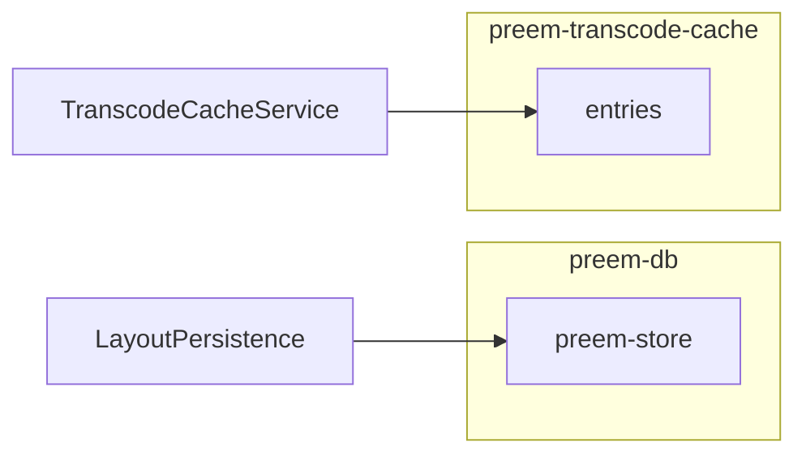

# Preem Persistence

**When to use:** Adding persistence, cache layers, or working with IndexedDB. See [preem-transcode-pipeline](../preem-transcode-pipeline/SKILL.md) for import/cache flow, [preem-architecture](../preem-architecture/SKILL.md) for data placement.

## When to Use IndexedDB vs NgRx

| Use IndexedDB | Use NgRx |
|---------------|----------|
| Binary blobs (transcoded video, thumbnails) | Metadata, UI state |
| Large data, cross-session | Small, in-memory, serializable |
| Cache with eviction | No eviction, full control |
| Key-value by content hash | Entity by app-generated ID |

**Rule:** NgRx state is in-memory and serializable. IndexedDB holds binary/cache data that does not belong in the store.

## Store Layout

| Database | Object Store | Used By |
|----------|--------------|---------|
| `preem-db` | `preem-store` | Layout state, future project data |
| `preem-transcode-cache` | `entries` | Transcoded MP4 blobs |

Separate DB for transcode cache avoids schema conflicts and quota pressure on app state. Uses [idb-keyval](https://github.com/jakearchibald/idb-keyval) `createStore(dbName, storeName)`.

**Files:** [indexed-db-store.ts](../../../src/app/shared/persistence/indexed-db-store.ts)

## Cache Key Design

Transcode cache keys are content hashes. Same source file (by content) reuses the same cache entry.

- **Input:** File first chunk (2MB) + file size (8 bytes) + last chunk (2MB)
- **Hash:** SHA-256 via `crypto.subtle.digest`
- **Worker:** [transcode-cache-key.worker.ts](../../../src/app/engine/transcode-cache-key.worker.ts)

Key computation runs in a Web Worker to avoid blocking the main thread.

## LRU Eviction

Cache entries include `lastAccessed`. On `QuotaExceededError`:

1. List all keys, read `lastAccessed` for each
2. Sort ascending (oldest first)
3. Remove oldest 25%
4. Retry `setCached` once

**Entry shape:** `{ blob, sizeBytes, lastAccessed, originalName? }`

## Migration and Compatibility

When adding fields (e.g. `originalName`):

- Use optional fields (`originalName?: string`)
- At read: `entry.originalName ?? fallback` for backwards compatibility
- No formal migration; handle missing fields gracefully

## Related Skills

- [preem-transcode-pipeline](../preem-transcode-pipeline/SKILL.md) — how cache is used in import flow
- [preem-architecture](../preem-architecture/SKILL.md) — store vs persistence placement
