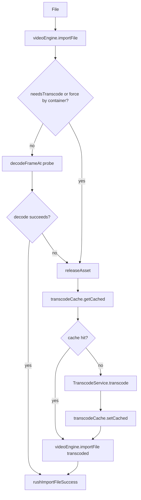

# Preem Transcode Pipeline

**When to use:** Modifying Rush import, transcode logic, or the Library drawer. See [preem-persistence](../preem-persistence/SKILL.md) for cache storage, [preem-ngrx-patterns](../preem-ngrx-patterns/SKILL.md) for effects.

## Import Flow

**Entry point:** [rush.effects.ts](../../../src/app/store/rush/rush.effects.ts) — `importWithTranscode`, `importFromLibrary`

## When Transcoding Happens

1. **Force by container:** `.mkv` always transcoded (`FORCE_TRANSCODE_EXTENSIONS`)
2. **Codec check:** `needsTranscode(videoCodec, audioCodec)` — see [transcode.service.ts](../../../src/app/engine/transcode.service.ts)
3. **Decode probe:** If codec strings look safe, `decodeFrameAt(assetId, 0)` tries one frame. Throws → fallback to transcode

### needsTranscode

Browser-safe video: `avc1`, `avc3`, `vp8`, `vp09`, `av01`  
Browser-safe audio: `mp4a`, `opus`, `mp3`, `vorbis`, `flac`

Uses `extractCodecFamily(codecString)` = first part before `.` (e.g. `avc1.64001f` → `avc1`).

## Cache vs Transcode

- **Cache first:** `transcodeCache.getCached(sourceFile, originalName)` — key from content hash
- **Miss:** `TranscodeService.transcode(file, onProgress)` (FFmpeg.wasm) → `setCached`
- **Hit:** Use cached File, skip transcode; still `setCached` updates `lastAccessed`

## Library vs Imported

| View | Source | Data |
|------|--------|------|
| **Imported** | NgRx `rush` slice | Session assets (imported this run) |
| **Library** | IndexedDB transcode cache | Transcoded files from past imports |

**Library "Add to Rush":** `rushImportFromLibrary({ cacheKey })` → `transcodeCache.getByKey(cacheKey)` → `videoEngine.importFile(file)` → no transcode (already MP4).

**Files:**
- [rush.effects.ts](../../../src/app/store/rush/rush.effects.ts)
- [transcode.service.ts](../../../src/app/engine/transcode.service.ts)
- [transcode-cache.service.ts](../../../src/app/engine/transcode-cache.service.ts)

## Related Skills

- [preem-persistence](../preem-persistence/SKILL.md) — cache key design, eviction
- [preem-ngrx-patterns](../preem-ngrx-patterns/SKILL.md) — effect structure
