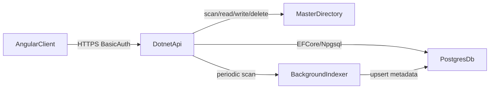

# Flish Architecture

## High-Level

## Backend Layout

- `Features/Files` - files listing, details, upload, download, delete
- `Features/Indexing` - scanner and index status/rebuild
- `Features/Auth` - HTTP Basic auth
- `Infrastructure/Persistence` - EF Core DbContext + entities
- `Infrastructure/Storage` - safe filesystem operations
- `Contracts` - API request/response DTOs

## Security Boundaries

- Only paths under configured `Storage:MasterDirectory` are allowed
- Relative paths are normalized and validated to block traversal
- Mutating endpoints require authentication
- Passwords are stored hashed (PBKDF2)

## Indexing Strategy

- Initial scan at startup
- Periodic incremental scan in a background service
- Upsert metadata by `relative_path`
- Mark missing files as `is_deleted = true`

